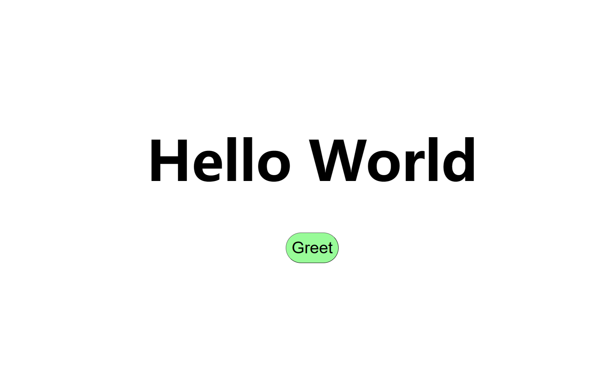

# Web-gRPC-Demo

一个 Vue3 + C++ 通过 [grpc-web](https://github.com/grpc/grpc-web) 与 [grpc](https://github.com/grpc/grpc) 后端通信的 Demo

## Guide

`在 WSL2 Ubuntu 22.04 通过测试`

1.首先编译`Server`中服务端，生成 Server 二进制文件并运行

2.`Proxy`用 envoy 代理 Server，因为前端无法直接沟通 grpc 后端

3.`Client` `yarn && yarn dev`开始调试,不出意外点击按钮`Greet`就可以得到如下结果,其中 `Hello` 来自 Server：

